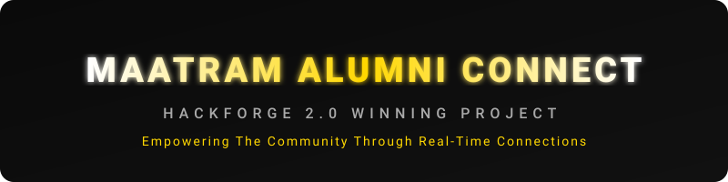
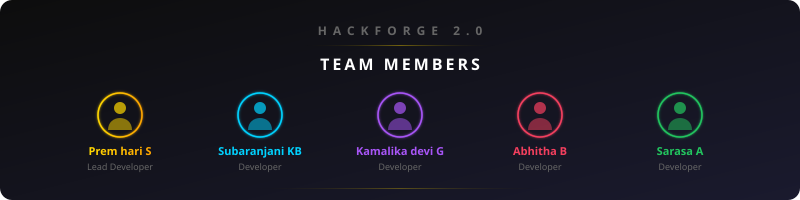

<div align="center">


<br/>


<p align="center">
  <a href="#overview">Overview</a> •
  <a href="#features">Features</a> •
  <a href="#architecture">Architecture</a> •
  <a href="#security">Security</a> •
  <a href="#installation">Installation</a> •
  <a href="#disclaimer">Disclaimer</a>
</p>


<br/>

*An enterprise-grade, real-time social networking platform originally developed as a project for the **Hackforge 2.0** hackathon conducted by the Maatram Foundation.*

</div>

---

<h2 id="overview" align="center">Project Overview</h2>

Maatram Alumni Connect is a full-stack, production-ready web application designed to bridge the gap between alumni, students, and administration. The platform operates similarly to modern professional networks, offering a suite of social tools tailored specifically for the institution.

It features real-time messaging, interactive event management, dynamic post feeds, advanced role-based access control, and an integrated AI chatbot assistant. The infrastructure is heavily optimized for mobile responsiveness and hardened with enterprise-level security protocols.

---

<h2 id="features" align="center">Core Features</h2>

<div align="center">

</div>

---

<h2 id="architecture" align="center">Technical Architecture</h2>

The platform is divided into two highly decoupled architectures:

<b>Frontend (Client)</b>
* Built with React 18 and Vite for lightning-fast bundling.
* Utilizes Framer Motion for fluid 3D scroll effects and micro-animations.
* State management and dynamic API routing via Context Providers.
* Rollup chunk-splitting and lazy loading for optimized production delivery.

<b>Backend (Server)</b>
* Node.js & Express REST API architecture.
* MongoDB Atlas for scalable NoSQL database management.
* Socket.io integration for bidirectional, event-driven real-time communication.
* Cloudinary API integration for handling secure, high-resolution media uploads.

---

<h2 id="security" align="center">Enterprise Security</h2>

This platform adheres to strict modern security standards:
* <b>Authentication:</b> Stateless JWT tokens with strict lifecycle management.
* <b>Data Integrity:</b> Bcrypt password hashing and Express Mongo Sanitize to prevent NoSQL injection.
* <b>Network Defense:</b> Helmet for secure HTTP headers, HPP to prevent parameter pollution, and XSS-Clean to neutralize cross-site scripting payloads.
* <b>Spam Mitigation:</b> Express Rate Limiting to prevent brute-force attacks and socket-level authentication.

---

<h2 id="installation" align="center">Local Installation</h2>

To run this application locally, ensure you have Node.js and MongoDB installed.

<b>1. Clone the repository</b>
```bash
git clone https://github.com/Premhari-7/Maatram-Alumni-Connect.git
```

<b>2. Setup Backend</b>
```bash
cd backend
npm install
```
Create a `.env` file in the backend directory containing your MongoDB URI, JWT Secret, and Cloudinary keys.
```bash
npm run dev
```

<b>3. Setup Frontend</b>
```bash
cd frontend
npm install
npm run dev
```

---

<h2 id="disclaimer" align="center">Intellectual Property Disclaimer</h2>

<div align="center">
<i>
Please note that this software was developed during the Hackforge 2.0 Hackathon. Certain assets within this repository—including the organizational logo, brand name "Maatram Foundation", and specific foundational information—are the exclusive intellectual property of the Maatram Foundation. These elements are utilized herein strictly to support the development of their alumni network and are explicitly excluded from the open-source MIT License of this codebase. All rights, title, and interest regarding the foundation's identity remain solely with the Maatram Foundation.
</i>
</div>

---

<div align="center">

</div>
